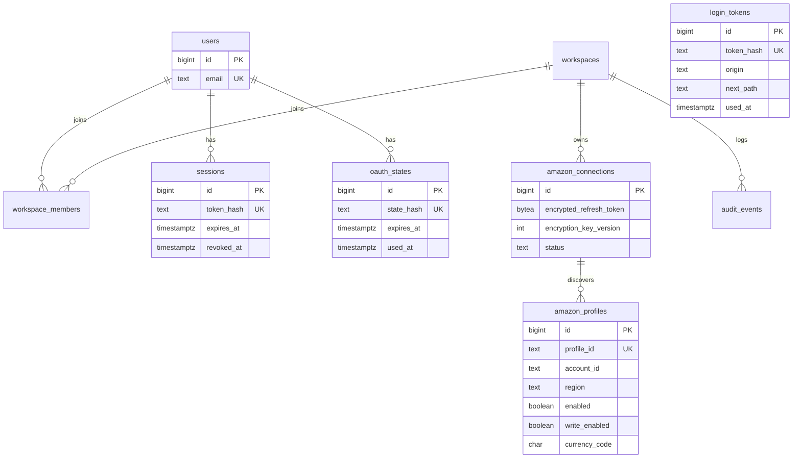
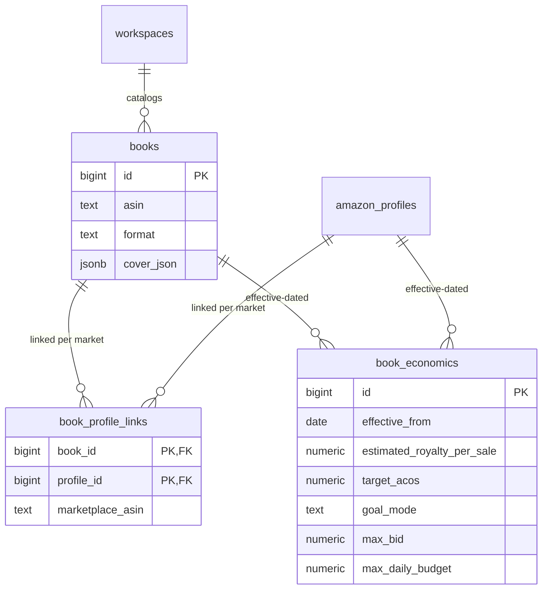
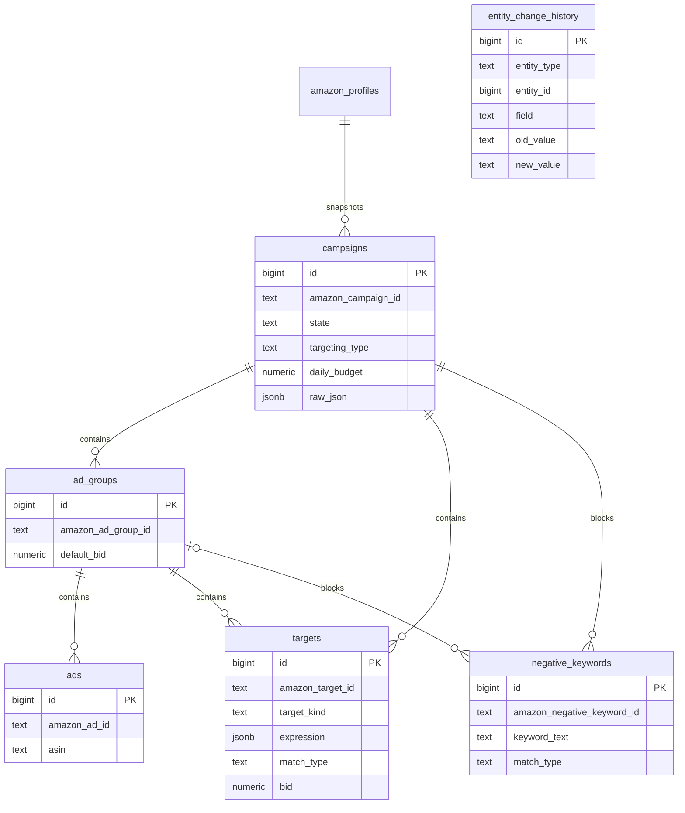
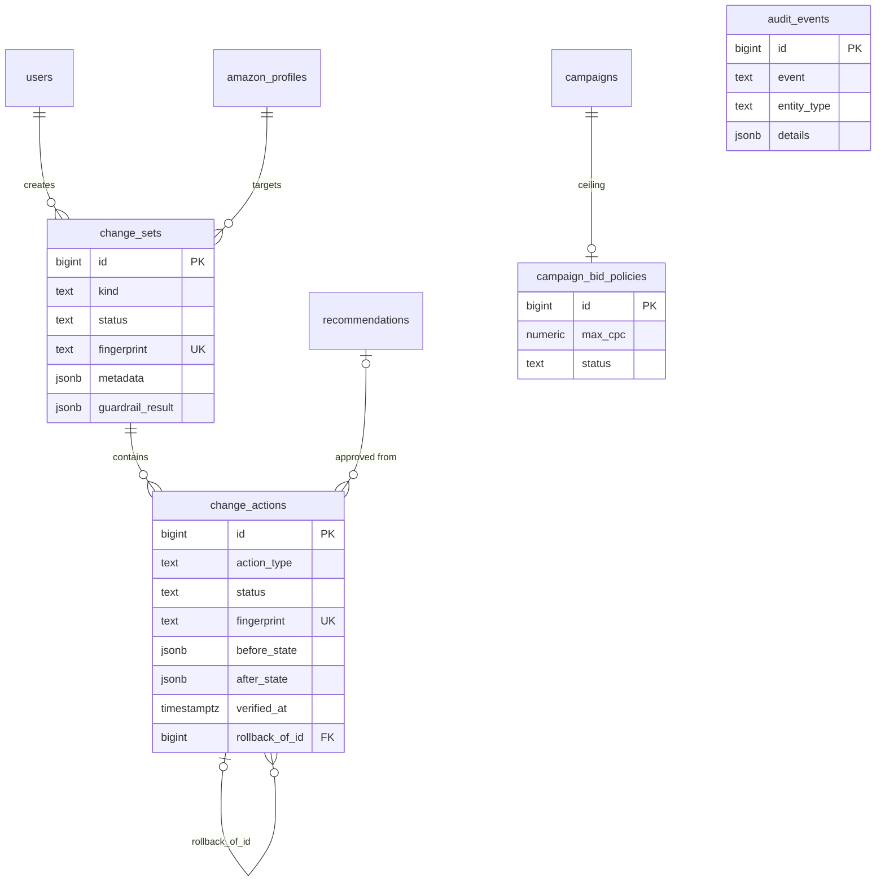

# Data model

The schema is plain SQL migrations in `packages/database/migrations/`,
applied in order by `src/migrate.ts`, each in its own transaction and recorded
in `schema_migrations`. The shape follows `docs/plan.md` §7.

## Migrations

| File                              | Adds                                                                                                                                                                                                                                                                                    |
| --------------------------------- | --------------------------------------------------------------------------------------------------------------------------------------------------------------------------------------------------------------------------------------------------------------------------------------- |
| `0001_initial.sql`                | The full §7 schema: identity/auth, Amazon connection, books/economics, structure snapshot, five daily fact tables, pipeline state, recommendations, change sets/actions, audit events.                                                                                                    |
| `0002_campaign_max_cpc.sql`       | `change_sets.kind` (`recommendation`/`max_cpc`/`rollback`) + `metadata` jsonb; new action types `update_ad_group_default_bid`, `update_campaign_bidding`, `update_optimization_rule`; `change_actions` gains `amazon_entity_id`, `entity_name`, `before_state`/`after_state` jsonb; the `campaign_bid_policies` table. |
| `0003_negative_exact_rollback.sql`| Action type `remove_negative_exact` — the compensating rollback for a verified negative-exact addition.                                                                                                                                                                                  |
| `0004_negative_keywords.sql`      | `negative_keywords` table persisting the campaign/ad-group negatives returned by structure sync.                                                                                                                                                                                         |
| `0005_campaign_creation.sql`      | Change-set kind `campaign_creation`; action types `create_campaign`, `create_ad_group`, `create_product_ad`, `create_keyword`.                                                                                                                                                             |
| `0006_login_token_origin.sql`     | `login_tokens.origin` — remembers the allowlisted web origin a login started from.                                                                                                                                                                                                       |
| `0007_product_targeting.sql`      | Action types `create_target` (ASIN product targets) and `add_negative_target` (campaign-level negative ASIN targets) — 12 action types total.                                                                                                                                              |
| `0008_login_token_next_path.sql`  | `login_tokens.next_path` — same-origin return path for the re-auth flow.                                                                                                                                                                                                                  |
| `0009_campaign_update.sql`        | Change-set kind `campaign_update`; action types `update_campaign_state` and `update_campaign_name`.                                                                                                                                                                                       |
| `0010_metric_units.sql`           | `units`, `units_sold_clicks7d`, and `units_sold_clicks14d` on all five daily fact tables.                                                                                                                                                                                                |

## Conventions

Established in `0001_initial.sql` and held throughout:

- Internal primary keys are `bigint generated always as identity`; Amazon
  identifiers are `text`, unique per profile (e.g.
  `unique (profile_id, amazon_campaign_id)`).
- Money is `numeric(19,4)` with `>= 0` checks (`campaign_bid_policies.max_cpc`
  requires `> 0`); currency is `char(3)` stored **per row** — never aggregate
  across currencies.
- Timestamps are `timestamptz`; dates are `date`.
- Attribution windows stay explicit: `purchases7d`/`sales7d`,
  `purchases14d`/`sales14d`, and `unitsSoldClicks7d`/`unitsSoldClicks14d` are
  separate columns everywhere.
- Partial indexes cover the hot paths: pending recommendations
  (`state = 'pending'`), runnable queue jobs (`status = 'pending'`), and
  unfinished report jobs (`status <> 'complete'`).

## Identity and auth

- `workspace_members.role` is a CHECK allowing only `'owner'` — single-owner
  by schema, not by policy.
- `sessions`, `login_tokens`, and `oauth_states` store **hashes only**; see
  [Security model](/architecture/security).
- `amazon_connections.status` is one of `connected`, `reconnect_required`,
  `disconnected`; the refresh token exists only as AES-256-GCM ciphertext in
  `encrypted_refresh_token` with its `encryption_key_version`.
- `amazon_profiles.profile_id` (Amazon's id) is **globally unique**. `region`
  is `NA`/`EU`/`FE`; `enabled` and `write_enabled` both default to `false` —
  new profiles import nothing and accept no writes until the owner opts in.
  `account_id` holds Amazon's entity id, used to build Amazon console links.

## Books and economics

- `books` is unique on `(workspace_id, asin, format)`; a book links to a
  marketplace through `book_profile_links.marketplace_asin`.
- `book_economics` is unique on `(book_id, profile_id, effective_from)` —
  effective-dated rows, so economic history is preserved. `goal_mode` is one
  of `profit`, `balanced`, `launch`, `visibility`; `target_acos` is a
  fraction in `[0, 1]`. These rows are **user-entered only**: the optimizer
  suppresses profit rules when no economics exist rather than guessing (see
  [Book economics](/guide/book-economics)).

## Structure snapshot

- `targets` holds both keywords and product targets, distinguished by
  `target_kind` (`keyword` | `product`). Keywords store
  `{type, value}` in `expression` and carry a `match_type`; product targets
  store the raw targeting expression and leave `match_type` null.
- `negative_keywords.ad_group_id` is nullable: null means campaign-level.
- Every structure upsert diffs name/bid/budget/state and appends to
  `entity_change_history` (`entity_type` is `campaign`, `ad_group`, `ad`, or
  `target`; `entity_id` is the internal PK), giving an Amazon-side change
  feed between syncs.

## Daily facts

Five tables, one per report grain, with identical metric columns —
`impressions`, `clicks`, `cost`, `sales`, `orders`, `units`, `purchases7d`,
`sales7d`, `purchases14d`, `sales14d`, `units_sold_clicks7d`,
`units_sold_clicks14d` (all non-negative) — plus `currency char(3)` per row.
`orders`, `sales`, and `units` are set from the 7-day attribution columns at
import; both windows stay stored explicitly.

| Table                             | Grain (unique key)                                   |
| --------------------------------- | ---------------------------------------------------- |
| `campaign_metrics_daily`          | `(profile_id, campaign_id, metric_date)`             |
| `target_metrics_daily`            | `(profile_id, target_id, metric_date)`               |
| `search_term_metrics_daily`       | `(profile_id, target_id, search_term, metric_date)`  |
| `advertised_product_metrics_daily`| `(profile_id, ad_id, metric_date)`                   |
| `placement_metrics_daily`         | `(profile_id, campaign_id, placement, metric_date)`  |

Entity ids in fact rows are **Amazon ids as text** (the report grain), not
foreign keys — facts must import even before structure sync has mapped the
entity. Each table carries a dashboard composite index on
`(profile_id, metric_date desc, <entity>)`. `placement_metrics_daily` has no
import path yet (placement reporting is out of MVP scope); the table exists
so the placement-opportunity rule can run the day one lands.

## Pipeline state

- `sync_runs` — one row per sync attempt: `kind` is `structure`, `metrics`,
  or `backfill`; `status` runs `running → complete | failed`.
- `report_jobs` — one row per report spec: `spec_fingerprint` is **unique**
  (the dedupe key), `amazon_report_id` is persisted for restart-safe resume,
  and `status` walks
  `queued → requested → polling → downloading → validating → importing →
  complete`, with `retryable`, `failed`, `dead_letter` for the unhappy paths.
  `checksum` + `storage_key` locate and verify the gzipped artifact.
- `job_queue` — durable work queue: `status` is `pending`, `running`,
  `done`, `failed`, or `dead`; `max_attempts` defaults to 5; leases use
  `lease_expires_at`/`heartbeat_at`/`locked_by`. Claim mechanics are in
  [Data pipeline](/architecture/data-pipeline#job-queue-mechanics).

## Recommendations

`recommendations` constrains `type` to the nine rules
(`wasteful_search_term`, `expensive_target`, `profitable_target`,
`search_term_harvest`, `budget_constrained_winner`,
`high_ctr_poor_conversion`, `low_impressions`, `placement_opportunity`,
`cannibalization_conflict`) and `state` to
`pending → approved | rejected | expired | applied` (plus `protected`).
`priority` is an integer 1–5 (quintile of the batch), `confidence` a
`numeric(4,3)` in `[0, 1]`, and every row carries its evidence window,
`rule_version`, `data_freshness_at`, and `expires_at`.
`recommendation_evidence.inputs` (jsonb) stores the exact rule inputs
immutably, so any recommendation is reproducible after the fact.

## Writes: change sets, actions, policies, audit

- `change_sets.kind` is `recommendation`, `max_cpc`, `rollback`, or
  `campaign_creation`; `status` walks
  `draft → previewed → applying → applied | partially_applied | failed |
  blocked`. `fingerprint` is unique, making creation idempotent.
  `metadata.dependsOnChangeSetId` orders dependent sets — apply rejects a set
  with `DEPENDENCY_NOT_APPLIED` until the referenced set is `applied`.
- `change_actions.action_type` allows twelve values: `update_bid`,
  `update_ad_group_default_bid`, `update_campaign_bidding`,
  `update_optimization_rule`, `add_negative_exact`, `remove_negative_exact`,
  `create_campaign`, `create_ad_group`, `create_product_ad`,
  `create_keyword`, `create_target`, `add_negative_target`. Each action has
  its own unique `fingerprint`, immutable `before_state`/`after_state`
  snapshots, the raw `amazon_request`/`amazon_response`, and `verified_at`
  set only after a post-write re-read confirms the change. `rollback_of_id`
  links a compensating action to the one it undoes.
- `campaign_bid_policies` is one row per campaign (`campaign_id` unique)
  holding the owner-set CPC ceiling; `status` is `pending`, `active`, or
  `drifted`.
- `audit_events` records every significant action per workspace (actor, IP,
  session, safe jsonb details — never secrets).

## Further reading

- [Data pipeline](/architecture/data-pipeline) — how rows land in these
  tables.
- [Security model](/architecture/security) — why credentials and sessions are
  stored the way they are.
- [API reference](/reference/api) — the read/write surface over this schema.
