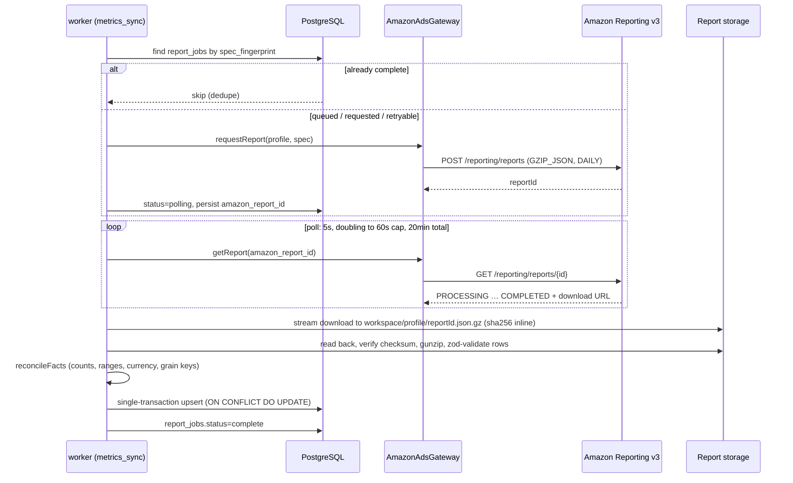

# Data pipeline

The worker (`apps/worker`) owns all data movement: discovering profiles,
pulling campaign structure, importing daily metrics through Amazon's
asynchronous Reporting v3, and generating recommendations. Everything is
idempotent — any step can be retried or replayed and the database converges
to the same state.

## Job queue mechanics

All work flows through the `job_queue` table
(`packages/database/src/queue.ts`), claimed by the loop in
`apps/worker/src/loop.ts`:

- **Claim** — one `pending` job with `run_at <= now()`, oldest first, selected
  `FOR UPDATE SKIP LOCKED` so concurrent workers never take the same job. The
  claim sets `status = 'running'`, increments `attempts`, and starts a lease
  (default 120 s, `WORKER_LEASE_SECONDS`).
- **Heartbeat** — every 30 s (`WORKER_HEARTBEAT_MS`) the running job's lease
  is extended. If the heartbeat finds the job no longer owned by this worker,
  the worker knows it was reaped.
- **Complete** — sets `status = 'done'` and clears the lock.
- **Fail** — if attempts remain, the job returns to `pending` with an
  exponential backoff `run_at`: full jitter, base 1 s, capped at 5 minutes
  (`packages/database/src/backoff.ts`). At `max_attempts` (default 5) the job
  becomes `dead`. Handlers can throw `TerminalJobError` for failures retrying
  cannot fix (validation errors, reconciliation failures, dead OAuth grants) —
  those dead-letter immediately.
- **Reap** — every 60 s (`WORKER_REAP_INTERVAL_MS`), `reapExpiredLeases`
  returns `running` jobs whose lease expired (dead worker) to `pending`.
- **Disconnect sweep** — when the owner disconnects Amazon,
  `failPendingJobsForProfiles` fails every still-pending job addressed to that
  connection's profiles so queued syncs never run against a dead grant.

Scheduling itself is a job: `schedule_tick` re-enqueues itself every 15
minutes and enqueues due recurring work deduped via `enqueueIfNotQueued` (a
`payload @> ?` match against pending/running jobs). See
[Architecture overview](/architecture/overview#runtime-lifecycle) for the
cadence table.

## structure_sync

`apps/worker/src/jobs/structure-sync.ts` pulls the profile's Sponsored
Products snapshot through the gateway (`syncCampaignStructure`: campaigns, ad
groups, ads, keywords, product targets, negative keywords) and applies it in
**one transaction** (`applyStructureSnapshot` in `apps/worker/src/store.ts`):

1. Campaigns, ad groups, and ads are upserted by their Amazon ids, which are
   unique per profile.
2. Keywords and product targets share the `targets` table, distinguished by
   `target_kind` (`keyword` | `product`); keywords store
   `{type: "keyword", value: keywordText}` in the `expression` jsonb column,
   product targets store the raw targeting expression.
3. Negative keywords are upserted at campaign and ad-group level, then
   `deleteMissingNegativeKeywords` removes rows Amazon no longer returns.
4. Every upsert diffs name/bid/budget/state and records changes into
   `entity_change_history` (`packages/database/src/repositories/structure.ts`),
   so the dashboard can show what changed on Amazon between syncs.

Each run is bracketed by a `sync_runs` row (`kind = 'structure'`) that ends
`complete` or `failed`. An unrecoverable auth error marks the connection
`reconnect_required` and dead-letters the job.

## metrics_sync — Reporting v3 orchestration

The core of the pipeline (`apps/worker/src/jobs/metrics-sync.ts`). Payload:

```json
{ "profileId": "…", "startDate": "YYYY-MM-DD", "endDate": "YYYY-MM-DD" }
```

Date handling:

- The scheduled daily job syncs **yesterday** only; `recent_window_resync`
  separately re-imports the trailing 14 days for late attribution.
- A manual/legacy payload without dates falls back to the trailing **31
  complete UTC days**.
- Ranges are split into chunks of at most **31 inclusive days** — the
  Reporting v3 maximum — inside the one queue job, so a 60-day manual import
  still runs as a single unit and recommendations chain only after every
  chunk lands.

### Spec fingerprints and dedupe

For each chunk, one spec is built per report family — `spCampaigns`,
`spTargeting`, `spSearchTerm`, `spAdvertisedProduct`
(`apps/worker/src/report-specs.ts`). Placement reporting has no stable daily
import path yet, so no spec is built for it. Every family requests DAILY rows
with explicit attribution columns: `impressions`, `clicks`, `cost`,
`purchases7d`, `sales7d`, `purchases14d`, `sales14d`, `unitsSoldClicks7d`,
`unitsSoldClicks14d`.

Each spec gets a deterministic fingerprint (`buildReportSpecFingerprint` in
`packages/database/src/fingerprint.ts`): the SHA-256 of a stable JSON
serialization of `{profileId, reportType, dateStart, dateEnd, columns}`, with
columns sorted and `REPORT_CONFIGURATION_VERSION` (currently
`reporting-v3-config-3`) prepended. Bumping that constant invalidates old
fingerprints when adapter-owned dimensions change, so a queued sync can never
adopt a stale artifact whose shape no longer matches the row schemas.

The fingerprint is a unique key on `report_jobs.spec_fingerprint`:

- A **complete** spec is never requested again — re-imports are free.
- A **failed** or **dead_letter** spec is retried, up to 5 attempts
  (`MAX_REPORT_ATTEMPTS`); past that the job is dead-lettered and the queue
  job fails terminally.

### Per-family flow



The `report_jobs` status machine: `queued → requested → polling → downloading
→ validating → importing → complete`, with `retryable`, `failed`, and
`dead_letter` off to the side.

Key properties:

- **Restart-safe resume.** The `amazon_report_id` is persisted as soon as
  Amazon issues it. After a worker restart, a job in `polling` or later
  resumes without re-requesting the report; the gateway's `reportOwner`
  callback (`findProfilePkForReport`) resolves which profile owns a persisted
  report id.
- **Polling** starts at 5 s, doubles each round, caps at 60 s, and gives up
  after 45 minutes total (`REPORT_POLL_*`). Observed Reporting v3 latency for
  daily Sponsored Products reports is 19–21 minutes, so the budget has to
  comfortably exceed that. A report that exhausts the budget stays `polling`
  with its `amazon_report_id` intact, so the queue retry resumes the same
  Amazon report instead of discarding the wait and requesting an identical
  one; only a report Amazon reports as `FAILURE` becomes `retryable` and is
  re-requested.
- **Download** streams the pre-signed URL straight to disk — never buffered
  in memory (`downloadReport` in
  `packages/amazon-ads/src/adapters/reporting.ts`). The artifact keeps
  Amazon's gzip as-is at
  `<workspaceId>/<profilePk>/<amazonReportId>.json.gz` under
  `REPORT_STORAGE_DIR`, written to a temp file and atomically renamed, with a
  sha256 computed inline (`apps/worker/src/storage.ts`). The pre-signed URL is
  never logged.
- **Validation** reads the artifact back, verifies the checksum, gunzips, and
  runs each family's zod row schema (`parseReportRows`). Adapter validation
  errors are terminal.
- **Reconciliation** (`reconcileFacts` in `apps/worker/src/reconcile.ts`)
  rejects the report unless: the mapped row count matches the file; counts
  are non-negative integers and money is non-negative; every row's date lies
  inside the requested range; every row's currency matches the profile
  currency; and no duplicate grain keys exist (entity + date).
- **Import** is a single transaction: rows are passed as jsonb, expanded with
  `jsonb_to_recordset`, and upserted `ON CONFLICT DO UPDATE` into the
  family's `*_metrics_daily` table
  (`packages/database/src/repositories/metrics.ts`). Replays converge.

### Run completion and chaining

The encompassing `sync_runs` row is marked `complete` **only when every
family fingerprint in every chunk reports `complete`** — adopted or resumed
report jobs included. Only then does the handler enqueue a
`recommendation_run` (deduped via `enqueueIfNotQueued`). Recommendations are
never generated from partial data.

## recommendation_run

`apps/worker/src/jobs/recommendation-run.ts` turns facts into ranked,
reviewable recommendations:

1. **Freshness gate.** The run skips entirely unless the profile has a
   `complete` metrics sync run finished within the last 48 hours
   (`RECOMMENDATION_FRESHNESS_HOURS`) — never recommend from a silent partial
   dataset.
2. **Expire stale**, then **load inputs**: the full structure snapshot, daily
   facts for the trailing 60 days (the longest evidence window), the latest
   effective book economics per marketplace ASIN, and applied change actions
   from the last 7 days (`cooldownDays`) so recently-touched entities stay
   quiet.
3. **Evaluate all nine rules** — wasteful search term, expensive target,
   profitable target, search-term harvest, budget-constrained winner,
   high-CTR-poor-conversion, low impressions, placement opportunity,
   cannibalization conflict — over each of the 7/14/30/60-day windows ending
   yesterday. Rules are pure functions in `packages/optimizer/src/rules/`
   with injected time; profit rules suppress themselves when the campaign has
   no KDP economics.
4. **Dedupe across windows**: the same rule firing on the same entity keeps
   only the highest-impact draft.
5. **Rank** deterministically (`packages/optimizer/src/rank.ts`): impact
   (micros) descending, then confidence, then rule version, then entity key.
   Priority maps rank onto quintiles — the top fifth of a batch is P1, the
   bottom fifth P5.
6. **Insert** each draft unless an identical pending recommendation already
   exists. Each row carries its evidence window, current/proposed values,
   confidence, `rule_version`, `data_freshness_at`, and
   `expires_at = now + 3 days` (`stalenessDays`); the exact rule inputs go to
   `recommendation_evidence.inputs` (jsonb, immutable) so every
   recommendation is reproducible.

Rule thresholds and formulas are documented in
[Optimization rules](/reference/optimization-rules); the review workflow in
[Recommendations](/guide/recommendations).

## Attribution model

Fact tables store both attribution windows explicitly and never merge them:
`purchases7d`/`sales7d`, `purchases14d`/`sales14d`, and
`unitsSoldClicks7d`/`unitsSoldClicks14d` are separate columns on every
`*_metrics_daily` table. At import time the convenience columns are set from
the 7-day window — `orders = purchases7d`, `sales = sales7d`,
`units = unitsSoldClicks7d` (`mapRowsToFacts` in `apps/worker/src/reconcile.ts`)
— and rows missing optional attribution columns default to 0. This is why
`recent_window_resync` exists: a conversion attributed 10 days late updates
the stored 7d/14d columns through the same idempotent upsert.

## Failure semantics at a glance

| Failure                                  | Result                                                              |
| ---------------------------------------- | ------------------------------------------------------------------- |
| Amazon report polling times out          | `retryable`, fresh report requested next attempt                    |
| Amazon report fails at source            | `retryable`, old report id superseded                               |
| Artifact checksum mismatch on read-back  | `failed`, retried                                                   |
| Zod validation / reconciliation failure  | Terminal — dead-letters after the attempt budget                    |
| Unrecoverable auth error                 | Connection marked `reconnect_required`, job dead-lettered           |
| Worker crash mid-job                     | Lease expires, `reapExpiredLeases` returns the job to `pending`     |
| 5 report attempts exhausted              | `dead_letter`; the metrics sync run fails and chains nothing        |
