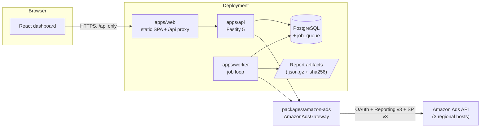

# Architecture overview

amazon-king is a **modular monolith** in a pnpm monorepo: three deployable
processes (web, api, worker) and six shared packages, all TypeScript, all
talking to one PostgreSQL database. The web server and worker run as separate
processes but ship as one product. The authoritative specification is
`docs/plan.md` in the repository root.

```text
apps/
  web/       dashboard (React + Vite)
  api/       browser-facing backend + OAuth callback (Fastify)
  worker/    imports, reports, analysis, scheduled jobs
packages/
  contracts/       shared zod request/response schemas
  amazon-ads/      OAuth client, token manager, regional gateway, API adapters
  database/        SQL migrations, repositories, PostgreSQL job queue
  optimizer/       pure, deterministic recommendation rules
  crypto/          AES-256-GCM envelope encryption for refresh tokens
  observability/   structured logging with secret redaction
```

## Component diagram



The browser talks only to `apps/web` (which proxies `/api` to `apps/api`). It
never holds an Amazon token and never calls the Amazon Ads API; all Amazon
traffic goes through the gateway behind the API or the worker.

## The three apps

### `apps/web` — dashboard

React 19 + Vite + TypeScript, TanStack Router (code-based routes) and TanStack
Query, Tailwind CSS v4, Recharts. It implements every screen in the plan §12
(dashboard, campaigns, search terms, books, recommendations, change center,
settings). All API responses are validated at the fetch boundary with the zod
schemas from `@amazon-king/contracts`, so a shape mismatch fails loudly in the
UI instead of corrupting state. A network-only service worker
(`apps/web/public/sw.js`) lets an HTTPS deployment be installed as a
standalone app without ever caching `/api` responses.

### `apps/api` — browser-facing backend

Fastify 5 (`apps/api/src/server.ts`) with cookie, CORS, helmet, and rate-limit
plugins. Responsibilities:

- **Login A sessions** — passwordless email sign-in, `ak_session` cookie,
  stateless HMAC CSRF tokens (see [Security model](/architecture/security)).
- **Login B OAuth** — the Amazon consent redirect and callback; the refresh
  token is envelope-encrypted before it touches the database.
- **Read API** — dashboard summary, campaigns, search terms, books,
  recommendations, audit events, all scoped to the caller's workspace.
- **Guarded writes** — change-set create/preview/apply/rollback and campaign
  creation in `apps/api/src/services/changes.ts`: fingerprint-idempotent
  creation, live before-state re-read, guardrail re-check, per-item apply,
  post-write verification.
- **Rate limits and recent-auth gates** — see
  [Security model](/architecture/security#rate-limits).

Route handlers are thin wrappers over injectable services; tests run against
an in-memory fake database, no network.

### `apps/worker` — background pipeline

A poll-claim-execute loop (`apps/worker/src/loop.ts`) over the PostgreSQL job
queue. One job at a time per worker process: a job is claimed with
`FOR UPDATE SKIP LOCKED`, given a 120-second lease (default
`WORKER_LEASE_SECONDS`) that is heartbeated every 30 seconds
(`WORKER_HEARTBEAT_MS`), and returned to `pending` by lease reaping every 60
seconds (`WORKER_REAP_INTERVAL_MS`) if the worker dies mid-job. SIGTERM/SIGINT
stop the loop after the in-flight job finishes — a graceful shutdown never
strands a claimed job.

Job handlers live in `apps/worker/src/jobs/`: `profile_discovery`,
`structure_sync`, `metrics_sync`, `recent_window_resync`,
`recommendation_run`, `connection_health`, and the self-rescheduling
`schedule_tick`. Handlers are read-only against Amazon in the MVP and depend
on injected store/gateway/storage/clock interfaces — they never read the wall
clock directly. See [Data pipeline](/architecture/data-pipeline) for the full
flows.

## The shared packages

- **`packages/contracts`** — zod schemas for every API request and response;
  the single source of truth shared by the web app's fetch boundary and the
  API's validators.
- **`packages/amazon-ads`** — the only code that talks to Amazon: LWA OAuth
  client, `TokenManager` (serialized per-connection refresh, 5-minute early
  skew, circuit breaker), a regional transport that honors `Retry-After` with
  full-jitter backoff, the `AmazonAdsGateway` interface, and the Reporting v3
  plus Sponsored Products v3 adapters. Every Amazon payload is strictly
  validated with zod at the boundary and translated to internal domain models.
- **`packages/database`** — plain SQL migrations under `migrations/`, a thin
  `pg` pool wrapper, explicit repository modules (parameterized SQL only), and
  the `FOR UPDATE SKIP LOCKED` job queue (`packages/database/src/queue.ts`).
- **`packages/optimizer`** — pure and deterministic: no I/O, no wall clock
  (time is injected). The nine §9 rules, guardrails, smoothed conversion
  rates, ±15% bid clamp, and ranking. Money is integer micro-units internally
  with decimal strings at the boundaries.
- **`packages/crypto`** — AES-256-GCM envelope encryption for Amazon refresh
  tokens with versioned keys; ciphertext embeds the key version.
- **`packages/observability`** — pino loggers with a built-in redaction list
  (tokens, codes, secrets, pre-signed URLs) and `redactSecrets` for unknown
  error payloads.

Dependency direction is one-way: apps depend on packages, packages never on
apps, and `optimizer` depends on nothing with side effects.

## Runtime lifecycle

Recurring work is driven entirely by the job queue — no cron, no external
scheduler. On boot the worker enqueues a `schedule_tick` job if none is
pending (`apps/worker/src/index.ts`). Each tick enqueues whatever is due,
records the timestamps in its own payload (so they survive restarts), and
re-enqueues itself 15 minutes out (`SCHEDULE_TICK_MS`), guarded by
`enqueueIfNotQueued` so a retried tick never duplicates work.

Cadence, from `apps/worker/src/jobs/schedule-tick.ts`:

| Job                       | Cadence                                                     |
| ------------------------- | ----------------------------------------------------------- |
| `profile_discovery`       | Every 24 h                                                  |
| `connection_health`       | Every 4 h                                                   |
| `structure_sync`          | Every 45 min per enabled profile                            |
| `metrics_sync`            | Once daily per enabled profile, after 05:00 UTC (yesterday) |
| `recent_window_resync`    | Once daily per enabled profile, trailing 14 days            |
| `recommendation_run`      | Chained by `metrics_sync` after a complete import           |

Two deliberate design points:

- `recommendation_run` is **never scheduled directly**. It runs only after a
  metrics sync in which every report family completed, so recommendations are
  never generated from a partial dataset. A 48-hour freshness gate
  (`RECOMMENDATION_FRESHNESS_HOURS`) skips the run when data is stale.
- `recent_window_resync` exists because Amazon attribution lags: conversions
  keep landing on recent days after the first import, so the trailing 14-day
  window (`RECENT_WINDOW_DAYS`) is re-imported daily and idempotent upserts
  correct the fact rows.

## Design rules

These are binding constraints from `docs/plan.md`; the codebase enforces them
mechanically, not by convention.

- **Two separate logins.** App sign-in (Login A, passwordless email) and the
  Amazon OAuth connection (Login B) are fully independent. The app session
  never contains an Amazon token.
- **Browser isolation.** The browser never receives the LWA client secret, an
  access token, or a refresh token, and never calls the Amazon Ads API
  directly. All Amazon traffic goes through the backend gateway.
- **Gateway boundary.** Every Amazon payload is strictly validated and
  translated to internal models inside `packages/amazon-ads`. The optimizer
  never sees raw Amazon field names.
- **Idempotent pipeline.** Reports are asynchronous (request → poll →
  download → validate → reconcile → batch upsert with
  `INSERT ... ON CONFLICT DO UPDATE`), deduped by deterministic spec
  fingerprints, so re-running any step converges instead of duplicating.
- **Deterministic optimizer.** Rules only — no LLM decisions. Every rule is
  versioned, stores its exact inputs as immutable evidence, requires minimum
  evidence, uses smoothed conversion rates, clamps bid changes to ±15% per
  cooldown period, and expires when data goes stale. Profit rules are
  suppressed (never guessed) when the owner has not entered KDP economics.
- **Guarded writes.** Read-only is the default per profile. Applying a change
  requires an immutable change set, a fresh re-read of Amazon state matching
  the approved before snapshot, guardrail re-checks, an idempotency
  fingerprint, per-item result handling, post-write re-read verification, and
  an audit log entry. A global kill switch disables all writes immediately and
  fails closed.

## Production deployment shape

`compose.production.yml` runs five services on one host:

- **db** — `postgres:16-alpine` with a persistent volume and healthcheck.
- **migrate** — one-shot container that applies the SQL migrations
  (`scripts/migrate.ts`) before anything else starts; api and worker wait on
  its successful completion.
- **api** — Fastify on port 3000 (container-internal), `TRUST_PROXY=true`
  behind the reverse proxy.
- **worker** — the job loop; report artifacts stream to the `report-data`
  volume mounted at `/app/.data/reports` (`REPORT_STORAGE_DIR`), stored
  gzipped with a sha256 checksum per artifact.
- **web** — serves the built SPA and proxies `/api`; the only published port,
  bound to `${APP_BIND_ADDRESS:-127.0.0.1}:${APP_PORT:-8080}`. It is loopback
  by default because a TLS-terminating reverse proxy in front (see
  `deploy/nginx.conf`) is the expected public entry point.

Secrets come from the environment file only — no secrets in images, none in
the repository. See [Self-hosting](/guide/self-hosting) for the full setup and
[Operations](/guide/operations) for day-2 runbooks.

## Where to go next

- [Data pipeline](/architecture/data-pipeline) — sync flows, the job queue,
  and the recommendation run in detail.
- [Security model](/architecture/security) — the two logins, CSRF, rate
  limits, and guarded writes.
- [Data model](/architecture/data-model) — the PostgreSQL schema, table by
  table.
- [Key concepts](/guide/key-concepts) — the product-level vocabulary these
  components implement.
