# Security model

The security posture follows `docs/plan.md` §13: the app holds powerful
Amazon credentials, so the design assumes the browser is hostile territory
and keeps every secret server-side. This page describes what the code
actually enforces, with file references.

## Two separate logins

Login A (app sign-in) and Login B (the Amazon OAuth connection) are
independent systems that never share state. The app session never contains
an Amazon token; the Amazon flow requires an app session but adds nothing to
it.

```mermaid
sequenceDiagram
    participant B as Browser
    participant API as apps/api
    participant DB as PostgreSQL
    participant LWA as Login with Amazon

    rect rgb(60, 70, 90)
        note over B,DB: Login A — passwordless email (app session)
        B->>API: POST /api/session/login {email, next?}
        API->>DB: login_tokens row (HMAC-SHA256 hash, 15-min TTL, origin)
        API-->>B: 200 (email sent, dev logs the link)
        B->>API: GET /api/session/verify?token=…
        API->>DB: consume token (single-use), create session (hash only)
        API-->>B: Set-Cookie ak_session, redirect to stored origin + next
    end

    rect rgb(70, 80, 60)
        note over B,LWA: Login B — Amazon OAuth (per workspace)
        B->>API: POST /api/integrations/amazon/start
        API->>DB: oauth_states row (state hash, user-bound, 10-min TTL)
        API-->>B: LWA consent URL (scope advertising::campaign_management)
        B->>LWA: owner consents
        LWA->>API: GET callback?state=…&code=…
        API->>DB: mark state used BEFORE exchange
        API->>LWA: server-side code exchange (client secret)
        LWA-->>API: refresh token
        API->>DB: AES-256-GCM encrypt → amazon_connections
    end
```

### Login A — passwordless email

Implemented in `apps/api/src/services/session.ts`.

- `POST /api/session/login` generates a 32-byte random token and stores only
  its keyed HMAC-SHA256 hash in `login_tokens`, with a **15-minute TTL**
  (`LOGIN_TOKEN_TTL_MS`). The endpoint always returns 200 — it never reveals
  whether an address is allowed.
- When `OWNER_EMAIL` is set (required in production), any other address is a
  silent no-op: no token is issued and the response is identical.
- The token remembers the **origin** the login started from, checked against
  an exact allowlist: the configured `WEB_ORIGIN` always; in development
  only, localhost/127.0.0.1 on any port and `https://*.trycloudflare.com`
  quick tunnels. An optional `next` path returns the user to the page that
  required re-auth; only same-origin relative paths matching `^/[^/\\]` (max
  500 chars) are accepted, and the stored value is re-validated at verify
  time.
- `GET /api/session/verify` **consumes** the token atomically (single-use),
  provisions the owner user/workspace on first login, and creates a session.
- Sessions live 7 days, **rolling** — every authenticated request extends
  expiry (`SESSION_TTL_MS`). Only the token hash is stored server-side, plus
  IP and user agent for audit.
- The `ak_session` cookie is `HttpOnly`, `SameSite=Lax`, `Path=/`, and
  `Secure` outside development.

### Login B — Amazon Ads OAuth

Implemented in `apps/api/src/services/amazon.ts` and
`packages/amazon-ads/src/oauth.ts`.

- The consent URL requests exactly one scope:
  `advertising::campaign_management`.
- `state` is a 32-byte random value; only its hash is stored in
  `oauth_states`, bound to the authenticated user, with a **10-minute TTL**
  (`OAUTH_STATE_TTL_MS`).
- On callback the state is **marked used before the code exchange**, so a
  replayed callback can never exchange twice. A state issued to a different
  user is refused (`foreign_state`). Missing/unknown/expired state redirects
  with `invalid_state` — no error detail leaks.
- The authorization code is exchanged **server-side** with the LWA client
  secret. The returned refresh token is envelope-encrypted (below) before it
  is written to `amazon_connections.encrypted_refresh_token` (bytea) with its
  `encryption_key_version`.
- Token refresh (`packages/amazon-ads/src/token-manager.ts`) is **serialized
  per connection** with an in-process mutex, refreshes 5 minutes before
  expiry, and runs a **circuit breaker**: an unrecoverable refresh error
  marks the connection `reconnect_required`, fires `onReconnectRequired`
  once, and refuses further attempts until the owner reconnects. The
  ciphertext is decrypted only in the API/worker, immediately before a
  refresh (`apps/worker/src/tokens.ts`).
- Disconnect wipes the ciphertext first, then fails every pending queue job
  for the connection's profiles (`failPendingJobsForProfiles`) so no sync
  runs against a dead grant.

## Browser isolation

- The LWA **client secret exists only in the deployment environment** — never
  in code, never per-user, never logged. `apps/api/src/config.ts` refuses to
  boot without it, and production config additionally requires `OWNER_EMAIL`,
  `API_PUBLIC_URL`, SMTP settings, and a non-default 32+ char
  `SESSION_SECRET`.
- The browser receives only the consent URL and redirects from the OAuth
  flow — never codes or tokens — and never calls the Amazon Ads API directly;
  all Amazon traffic goes through the backend gateway.
- **Strict CSP** via helmet on the API: `default-src 'none'`,
  `frame-ancestors 'none'` (the API serves JSON only, so nothing else is
  needed).
- **CORS** is limited to the exact `WEB_ORIGIN` with credentials enabled.
- The installable web app's service worker (`apps/web/public/sw.js`) is
  network-only: it bypasses every `/api` request and non-GET request
  entirely, so no Amazon data is ever cached by the browser.

## CSRF

Mutations use a **stateless, session-derived CSRF token**:
`HMAC-SHA256(SESSION_SECRET, "csrf:" + sessionTokenHash)`
(`csrfTokenFor` in `session.ts`). The token is exposed on `GET /api/session`
and must be sent back as the `x-csrf-token` header on every POST/PATCH/DELETE
under `/api` — compared with `timingSafeEqual`. The only exemption is
`POST /api/session/login`, which has no session yet. Because the token
derives from the session rather than being stored, there is nothing to
rotate or leak server-side, and logout invalidates it implicitly.

## Rate limits

`@fastify/rate-limit` with a global ceiling plus per-route buckets
(`apps/api/src/server.ts`):

| Bucket  | Limit          | Routes                                                        |
| ------- | -------------- | ------------------------------------------------------------- |
| Global  | 200 req/min    | everything                                                    |
| STRICT  | 10 req/min     | login request/verify, OAuth start/callback                    |
| WRITE   | 20 req/min     | syncs, book mappings/covers, change-set apply/rollback, max-cpc, campaign creation |
| PREVIEW | 120 req/min    | change-set preview (a read, but expensive; the Change center fetches one per visible set) |

Over-limit requests get `429` with error code `RATE_LIMITED`.

## Recent authentication

Spend-changing actions require a session created within the last **15
minutes** (`RECENT_AUTH_MS`, `isRecentAuth`): applying a change set, rolling
back an action, setting a campaign max CPC, and creating campaign-creation
change sets. A gated call from an older session fails with
`401 REAUTH_REQUIRED`; the web app answers with a one-click re-auth dialog
whose magic link carries the current page as `next`. One deliberate
exception: retrying a **failed** change set replays an already-approved
payload through the same guarded path (Amazon state is re-read and compared
before anything is sent), so it skips the recent-auth gate.

## Guarded writes

Writes default to **off at two independent levels**, and both fail closed:

- The global **kill switch** (`KILL_SWITCH`) defaults to enabled — writes
  stay disabled unless the operator explicitly sets `KILL_SWITCH=false`.
- Every profile starts `write_enabled = false`; applying to a read-only
  profile fails with `WRITES_DISABLED`.

The apply path in `apps/api/src/services/changes.ts` then enforces, in order:
the change set is immutable and fingerprint-idempotent; recommendations in it
must not be expired; **live Amazon state is re-read** and compared against
the approved before snapshot (`STALE_BEFORE_STATE` blocks the set);
guardrails re-run (`GUARDRAIL_VIOLATION` blocks); each action is applied with
per-item result mapping; and every applied action is **verified by a fresh
re-read** (`verified_at` set, else `verification_failed`). Rollback is a
compensating API action recorded with `rollback_of_id`, never a database
undo. Every step writes `audit_events`. See
[Applying changes](/guide/applying-changes) for the operator workflow.

## Secret handling

- **Redaction is built into the loggers** (`packages/observability`):
  authorization headers, access/refresh tokens, client secrets, OAuth codes,
  and pre-signed report download URLs are censored as `[REDACTED]` at the top
  level and one level deep. `redactSecrets` deep-clones unknown payloads
  (Amazon error bodies, request payloads) before they reach logs or error
  tracking. The report downloader logs "URL redacted" and never the
  pre-signed URL itself.
- **Token encryption** (`packages/crypto`): AES-256-GCM with a master key
  from `TOKEN_ENCRYPTION_KEY` (64 hex chars = 32 bytes). Ciphertext format is
  `keyVersion (uint16 BE) | iv (12 B) | authTag (16 B) | ciphertext`, so the
  version travels with the data. Rotation means adding
  `TOKEN_ENCRYPTION_KEY_V2` (and so on) — old rows keep decrypting under
  their recorded version.
- **Audit events** store only safe, non-secret details by schema convention;
  OAuth callback failures log only the sanitized error code, never the code
  or token material.

## Database isolation and roles

All queries are scoped by `workspace_id` (the product is single-owner, but
isolation is enforced in the data layer, not assumed). The plan calls for
row-level security when deployed on Supabase and for separate low-privilege
web, worker, and migration roles; the bundled compose deployment uses a
single database user, so treat network isolation of the database as the
boundary there. See [Self-hosting](/guide/self-hosting) for hardening notes.

## Operator guidance

- Keep encrypted PostgreSQL backups with point-in-time recovery; the report
  artifact volume is re-downloadable and does not need backup.
- The incident procedure — disable writes via the kill switch, rotate
  `SESSION_SECRET`/`TOKEN_ENCRYPTION_KEY*`, invalidate sessions, disconnect
  Amazon — is documented in [Operations](/guide/operations).
- Never test write operations against important live campaigns first: use a
  dedicated low-risk campaign, one profile, one manually approved action.
