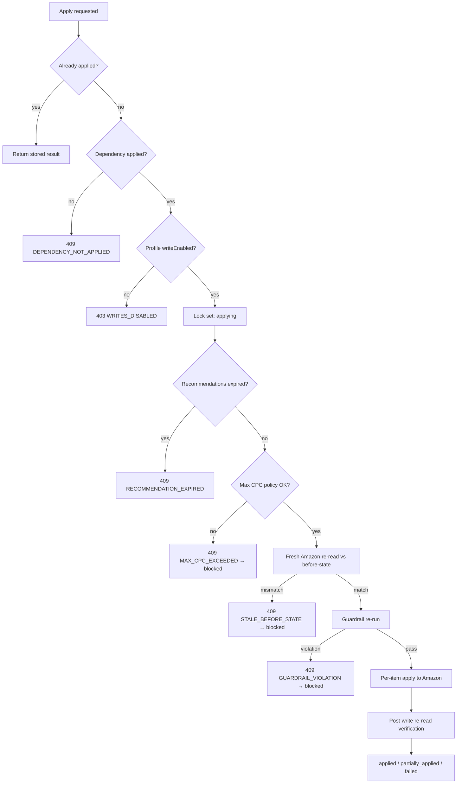

# Applying & Rolling Back Changes

Every Amazon write goes through one guarded pipeline. Read-only is the
default at two levels — the global `KILL_SWITCH` and per-profile
`writeEnabled` — and even with both open, nothing is sent to Amazon without a
fresh re-read proving the account still looks like what you approved.


## Change sets

A change set is an **immutable, human-approved unit of work**: a set of
actions (bid updates, negative keywords, campaign creations) plus the
before-state they were approved against. Approving a recommendation creates
one; so do the [campaign tools](/guide/campaign-tools) (Max CPC, campaign
creation, cannibalization negatives) and rollback.

### Status lifecycle

```text
draft → previewed → applying → applied
                         ↓     → partially_applied
                     failed ←──┘  (retryable)
                     blocked      (terminal: stale, guardrail, or Max CPC violation)
```

- `draft` / `previewed` — created, not yet applied. Previewing records the
  `previewed` status.
- `applying` — optimistic lock while the pipeline runs; a second apply
  attempt fails with `409 APPLY_IN_PROGRESS`.
- `applied` / `partially_applied` — terminal success states; re-applying is
  idempotent and returns the stored result without touching Amazon again.
- `failed` — the apply raised before or during the write. Retryable (see
  below).
- `blocked` — the pipeline refused the set: stale before-state, guardrail
  violation, or a Max CPC conflict. Terminal — create a fresh set from
  current data.

## The change center

`/changes` lists every change set as an expandable row. The preview —
actions and guardrail violations — is fetched lazily on first expand, so the
page does not fan out one request per set. Inside an expanded set you get:

- each action with its before → after values and per-action status,
- guardrail violations when present,
- a **confirm dialog** before applying (danger-styled; the button reads
  *Retry apply* for failed sets),
- per-action **rollback buttons** where the action supports it, and
- a **dependency lock notice** when the set depends on another set that has
  not been applied yet (see [Cannibalization](/guide/campaign-tools#resolving-cannibalization)) — the apply button is
  replaced by the notice until the dependency is `applied`.

## The apply pipeline

Applying runs these steps in order, inside the API:



1. **Kill switch and profile gate.** The global kill switch is evaluated on
   every guarded path; a read-only profile fails with
   `403 WRITES_DISABLED`.
2. **Dependency check.** A set carrying `dependsOnChangeSetId` refuses with
   `409 DEPENDENCY_NOT_APPLIED` until the referenced set is `applied`.
3. **Optimistic lock.** Only `draft`, `previewed`, or `failed` sets can
   enter `applying`; concurrent applies get `409 APPLY_IN_PROGRESS`.
4. **Expiry re-check.** If any linked recommendation has expired, the set
   drops back to `previewed` with `409 RECOMMENDATION_EXPIRED` — re-create it
   from fresh data.
5. **Max CPC policy.** Any proposed bid above an active campaign ceiling
   fails with `409 MAX_CPC_EXCEEDED` and blocks the set.
6. **Fresh re-read vs. before-state.** The API re-reads the live Amazon
   structure and compares it to the stored before snapshot. Any drift fails
   with `409 STALE_BEFORE_STATE` and blocks the set. Actions Amazon already
   satisfies (e.g. the negative already exists) are marked applied without
   being resent — apply is idempotent at the action level.
7. **Guardrail re-run.** Bid clamps, cooldowns, staleness, and change-set
   size limits are re-evaluated at apply time, not approval time. A violation
   blocks the set with `409 GUARDRAIL_VIOLATION` and per-violation details.
8. **Per-item apply.** Amazon's per-item (207-style) results are mapped
   individually — a batch success never implies an item succeeded.
9. **Post-write verification.** The intended state is re-read from Amazon;
   each action is stamped `verified_at`, or marked `verification_failed`.
10. **Final status.** All items applied → `applied`; some failed →
    `partially_applied`; the write itself raised → `failed`.

Every step is audit-logged with the actor, session, and IP.

## Retrying a failed set

A `failed` set can be retried in place. Because the payload was already
approved once, the retry **skips the recent-auth gate** — but it goes through
the same guarded pipeline, including the fresh Amazon re-read, so a retry can
never push a stale change through.

## Idempotency and fingerprints

Each change set and each action carries a fingerprint of its canonical
content. Submitting an identical payload twice returns the existing set
instead of creating a duplicate; the audit event records `replayed: true`.
Combined with the status lock and the already-satisfied check, repeating any
step of the flow is safe.

## Recent authentication

Spend-changing actions — first-time applies, rollbacks, Max CPC, campaign
creation — require a sign-in from the **last 15 minutes**. If your session is
older, the API answers `401 REAUTH_REQUIRED` and the UI opens the
**re-authentication dialog**: one click emails a single-use magic link to
your address (no typing), carrying the current page as its `next` path.
Verifying the link lands you back on the same page to retry the action.

## Rollback

Rollback is a **compensating Amazon action**, not a database undo. Requesting
rollback on an applied action creates a new `rollback` change set that goes
through the full pipeline and, on success, marks the original action
`rolled_back`.

- **Rollbackable:** applied `update_bid` actions (restores the stored
  before-bid) and applied, app-created `add_negative_exact` actions (via
  `remove_negative_exact`).
- **Not rollbackable:** campaign creations, and negative ASIN targets. The
  UI only shows rollback buttons where a verified compensating operation
  exists.
- The rollback's guardrail cooldown check **exempts the set being undone**,
  so rolling back a change is never blocked by the cooldown that change
  itself created.

## Kill switch and read-only defaults

Two independent switches must both be open for any write:

1. `KILL_SWITCH=false` globally — fail-closed; only the exact string
   `"false"` opens it (see [Configuration](/guide/configuration#kill-switch-semantics)).
2. `writeEnabled` on the profile (Settings → Profiles).

::: warning
Amazon write operations have not completed end-to-end validation against a
live Amazon account in this alpha. Keep the kill switch on until you have run
the live validation sequence with a test account or a dedicated low-risk
campaign and a small, explicitly approved change.
:::
