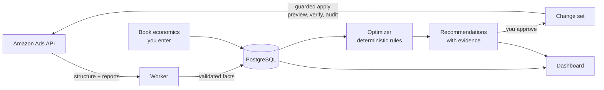

# What is Amazon King?

Amazon King (`amazon-king`) is an open-source, self-hosted web application that
connects to your own Amazon Ads account, imports your Sponsored Products
campaign data, analyzes it against your real KDP book economics, and produces
prioritized recommendations with the evidence behind each one. Nothing changes
in your Amazon account until you explicitly approve it.

It is an **advisory system with a human approval gate**, not an autonomous ad
bot.

## The problem it solves

If you advertise books through KDP, you have probably run into all three of
these:

- **ACoS alone can't tell you profit.** Amazon reports ACoS as ad spend over
  retail revenue. But you don't earn retail revenue — you earn a royalty. A
  campaign at 40% ACoS can be losing money on a 35%-royalty ebook and making
  money on a 70%-royalty one. The break-even line depends on your royalty per
  sale, which Amazon never sees.
- **The Amazon Ads console has no royalty economics.** There is nowhere to
  enter "I earn $2.09 per sale of this paperback," so the console cannot tell
  you which targets are actually profitable. You end up exporting reports and
  maintaining a spreadsheet by hand.
- **Automation tools are opaque SaaS.** Third-party optimizers want
  multi-client access to your ad account, change bids on a schedule you can't
  inspect, and rarely explain why a change was made. For a single-author
  business, that trade-off is hard to justify.

Amazon King takes a different position: your infrastructure, your credentials,
deterministic rules you can read, and your approval on every write.

## What it does

- **Imports your data on a schedule.** Campaign structure every 45 minutes and
  performance metrics daily (with a 14-day trailing re-sync to absorb Amazon's
  attribution lag), across four Sponsored Products report families: campaigns,
  targeting, search terms, and advertised products. Raw reports are kept as
  compressed artifacts; validated facts land in PostgreSQL.
- **Models your book economics.** You enter the royalty you actually earn per
  sale per book and marketplace, your target ACoS, and a goal mode. The
  dashboard then shows estimated ad profit next to spend and sales — the
  number the Amazon console cannot give you.
- **Runs nine deterministic rules.** Wasteful search terms, expensive and
  profitable targets, search-term harvesting, budget-constrained winners,
  high-CTR-poor-conversion targets, low impressions, placement opportunities,
  and cannibalization conflicts. Every rule is versioned, requires minimum
  evidence, uses smoothed conversion rates, and clamps bid changes to
  ±15% per cooldown period. No LLM makes spend decisions.
- **Presents recommendations with evidence.** Each recommendation carries a
  priority (P1–P5), a confidence score, the exact evidence window and inputs
  the rule used, and an expiry — recommendations go stale when your data does.
- **Applies changes through a guarded write path.** Approving a
  recommendation creates an immutable change set. Applying it re-reads Amazon
  state and compares it against the snapshot, re-checks guardrails, applies
  item by item with per-item result handling, and verifies with a post-write
  re-read. Rollback is a compensating API action, and a global kill switch
  disables all writes instantly.

## How it fits together

The browser never talks to Amazon. All Amazon traffic goes through a backend
gateway that strictly validates every payload at the boundary.

## The product boundary

Amazon King is deliberately narrow. The MVP is:

- **One owner, one workspace.** Single-operator software. There is no
  multi-client tenancy, no team roles, no billing.
- **Sponsored Products only.** No Sponsored Brands or Sponsored Display.
- **Read-only by default.** Writes are disabled globally (kill switch) and
  per profile until you opt in.
- **Deterministic, explainable rules.** Every recommendation stores the exact
  inputs that produced it.
- **Manual approval for everything.** The MVP applies bid changes and negative
  exact keywords, and can create new campaigns as human-approved change sets.
  Full automation is a later phase, gated on weeks of observed results.

## When to use it

- You are a KDP author (or small publisher) running Sponsored Products ads in
  one or more marketplaces.
- You know your royalty per sale — or are willing to compute it — and want
  decisions based on profit, not retail ACoS.
- You want to self-host and keep your Amazon credentials on your own
  infrastructure.
- You are comfortable approving changes yourself and want to see exactly why
  each one is suggested.

## When not to use it

- You run an agency or manage ads for multiple clients — there is no
  multi-tenancy and none is planned for the MVP.
- You need Sponsored Brands, Sponsored Display, or DSP coverage.
- You want a fully autonomous tool that changes bids while you sleep. Amazon
  King will not do that in its current phases.
- You are unwilling to operate a small PostgreSQL-plus-Node stack.

## Status: alpha

Amazon King is alpha software. The codebase — data pipeline, optimizer,
guarded write path, dashboard — is implemented and tested, but it has not yet
completed a full end-to-end run against live Amazon credentials, and write
operations have not been validated against production campaigns. The kill
switch defaults to `true` (fail closed) for exactly this reason. Read the
[operations guide](/guide/operations) before enabling writes, and validate on
a dedicated low-risk campaign first.

## Where to go next

- [Key concepts](/guide/key-concepts) — the vocabulary used across the app and these docs
- [Installation](/guide/installation) — run the whole stack locally
- [Quickstart](/guide/quickstart) — a guided first session

---

Amazon, Amazon Ads, Kindle Direct Publishing, and KDP are trademarks of
Amazon.com, Inc. or its affiliates. Amazon King is an independent open-source
project and is not affiliated with or endorsed by Amazon.
