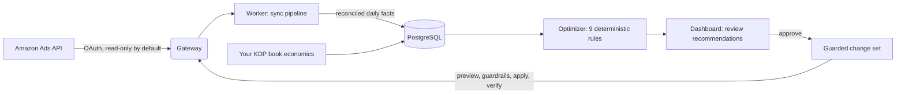

<div class="ak-section">

## Up and running in two commands

Requirements: Node.js 20+, pnpm 10, Docker, and GNU Make.

```sh
git clone https://github.com/simonScheff/amazon-king.git
cd amazon-king
make setup   # installs dependencies, creates .env
make run     # PostgreSQL + migrations + API + worker + dashboard
```

The dashboard starts on `http://localhost:5173` — in development, your sign-in
link is printed straight to the API log.

</div>

<div class="ak-section">

## A control room, not an autopilot

<div class="ak-screenshot">


</div>

<p class="ak-muted">
Amazon King is an advisory system. It imports your campaigns, finds what is
wasting or earning money, and prepares exact changes — you approve each one.
Automation is deliberately a later phase, gated on weeks of observed results.
</p>

</div>

<div class="ak-section">

## How it works



<p class="ak-muted">
Every write flows back through the same gateway after fresh state checks and
guardrail re-validation — and every step is recorded in the audit log.
</p>

[Explore the architecture →](/architecture/overview)

</div>

<div class="ak-section">

## Where to go next

- **New here?** Start with [What is Amazon King?](/guide/what-is-amazon-king) and the [quickstart](/guide/quickstart).
- **Running it locally?** Follow [installation](/guide/installation), then [connect your Amazon Ads account](/guide/connecting-amazon).
- **Deploying?** Read [self-hosting in production](/guide/self-hosting) and the [operations runbook](/guide/operations).
- **Integrating?** The [HTTP API reference](/reference/api) documents every endpoint, and [API workflows](/examples/api-workflows) shows copy-pasteable examples.

::: warning Alpha software
Amazon King is pre-1.0. Its write path has not completed end-to-end validation
against real Amazon credentials. Keep `KILL_SWITCH=true` and profiles read-only
until you have completed the live validation checklist.
:::

</div>
